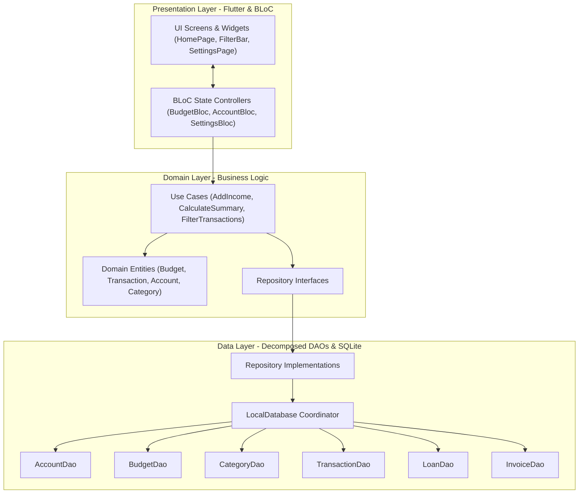

# Budget App

> Professional, offline-first personal and business financial management platform engineered with Flutter and Dart.

Budget App is an offline-first financial management system providing multi-currency budget planning, granular transaction tracking, bank account ledger management, loan amortization, invoicing, financial calculators, and cash flow projections.

---

## Key Features

### Core Budgeting & Transactions
- **Budget Lifecycle Management**: Create and manage monthly budgets across multiple calendar periods.
- **Transaction Ledger**: Track income and expense records with category assignments, receipt descriptions, and timestamps.
- **Multi-Bank Account Filtering**: Assign transactions to specific financial accounts (Checking, Savings, Credit Cards) and filter dashboard summaries in real-time.
- **Ergonomic Action Controls**: Centered 90% screen-width Floating Action Buttons (45% for Add Income, 45% for Add Expense) kept within thumb reach.
- **Anchored Filter Bar**: Search, Sort, Category Filter, and Account Filter buttons anchored on the left with a right-pinned Clear action to eliminate layout jumps.
- **Recurring Transactions**: Automate recurring bills, subscriptions, and income streams with daily, weekly, monthly, or yearly recurrence rules.
- **Financial Projections**: Forecast cash flow across 3, 6, and 12-month time horizons based on recurring transactions and scheduled payments.

### Advanced Financial Tools
- **Multi-Currency Support**: Native support for 20 global currencies (USD, EUR, GBP, JPY, CAD, AUD, ZAR, etc.) with custom offline exchange rate conversion.
- **Travel Budget Planner**: Duplicate existing budgets and convert category allocations to foreign currencies with automated exchange rate recalculations.
- **Loan & Debt Tracking**: Track money lent (assets) and money borrowed (liabilities) with installment schedules, interest calculations, and payment logs.
- **Emergency Fund Calculator**: Compute recommended 3, 6, and 12-month safety cushions and track runway progress.
- **Business Tools & Invoicing**: Generate professional PDF invoices with itemized rates, tax rules, and discount support. Track accounts payable to vendors.
- **Financial Calculators**: Net worth calculator, tip and split calculator, loan amortization tables, and compound interest savings projections.

### Data Security & Accessibility
- **100% Offline-First Architecture**: All database records reside strictly on your local device with zero cloud telemetry.
- **High Contrast Theme Mode**: WCAG 2.1 AA compliant high contrast theme mode for low-vision accessibility alongside Light, Dark, and System themes.
- **Biometric App Lock**: Secure application access via PIN or device biometrics (Touch ID / Face ID).
- **Export & Backup**: Export financial statements to CSV, PDF, and Excel (XLSX), or create encrypted SQLite database backups.

---

## Architecture & System Design

Budget App is structured under **Clean Architecture** principles, enforcing strict separation of concerns across Domain, Data, and Presentation layers.



### Decomposed DAO Database Layer
The persistence tier decomposes database queries into modular, single-responsibility Data Access Objects under `lib/core/database/`:
- `AccountDao`: Bank accounts, balances, and net worth queries.
- `BudgetDao`: Budget periods, metadata, and duplication.
- `CategoryDao`: Custom and default category models.
- `CategoryLimitDao`: Category spending thresholds and alert calculations.
- `EmergencyFundDao`: Emergency fund targets and tracked balances.
- `FinancialToolsDao`: Saved calculations and scratchpad state.
- `InvoiceDao`: Client invoices and itemized billing records.
- `LoanDao`: Loan agreements, debt balances, and payment logs.
- `TransactionDao`: Income and expense ledger entries with account filtering.

---

## Tech Stack

| Component | Technology | Description |
|:---|:---|:---|
| **Framework** | Flutter 3.x / Dart 3.x | Cross-platform client framework |
| **State Management** | `flutter_bloc` & `hydrated_bloc` | Reactive BLoC architecture with local preference cache |
| **Local Database** | SQLite via `sqflite` / `sqflite_ffi` | Embedded relational persistence layer |
| **Document Generation**| `pdf`, `printing`, `excel`, `csv` | Native PDF rendering, XLSX workbook generation, CSV export |
| **Charts** | `fl_chart` | Interactive balance curves and expense pie charts |
| **Security** | `flutter_secure_storage`, `local_auth` | Hardware-backed keychain and biometric authentication |
| **Documentation** | Sphinx, MyST, `sphinxcontrib-mermaid` | Docs-as-code portal with code-based Mermaid diagrams |
| **Task Automation** | `Taskfile.yml` (go-task) | Cross-platform build and testing pipeline |

---

## Getting Started

### Prerequisites
- Flutter SDK 3.x (pinned stable version)
- Dart SDK 3.x
- Android SDK, Xcode, or Linux/macOS/Windows desktop build toolchains

### Installation

```bash
# Clone the repository
git clone https://github.com/py-centric/budget_app.git
cd budget_app/budget_app

# Install dependencies
flutter pub get

# Launch the app
flutter run
```

### Using Task Runner (Taskfile.yml)

The repository provides standardized cross-platform tasks:

```bash
# Run all automated tests (1,270+ test suite)
task test

# Run code analysis and linting
task analyze
task lint

# Build release executables by edition (Linux Desktop)
task build:personal     # Build Personal Edition
task build:business     # Build Business Edition
task build:combined     # Build Combined Edition (Default)
task build:all          # Build all 3 release editions

# Build release packages by edition (Android APK)
task build:apk:personal
task build:apk:business
task build:apk:combined
task build:apk:all

# Run local development targets
task dev:personal       # Run Personal Edition
task dev:business       # Run Business Edition
task dev:combined       # Run Combined Edition (Default)

# Build Sphinx documentation portal with Mermaid diagrams
task docs
```

---

## Project Structure

```text
lib/
├── core/
│   ├── constants/       # App constants and default assets
│   ├── database/        # Decomposed DAOs (AccountDao, TransactionDao, BudgetDao, etc.)
│   ├── di/              # Dependency injection and service locator
│   ├── feature_flags/   # Release editions (Personal, Business, Combined)
│   ├── localization/    # Internationalization and ARB strings
│   ├── theme/           # Material 3 Light, Dark, and High Contrast themes
│   └── utils/           # Currency, date, and chart utilities
├── features/
│   ├── accounts/        # Multi-bank account management & net worth
│   ├── app_lock/        # Biometric & PIN lock security
│   ├── backup/          # Database backup & restore engine
│   ├── bill_splitting/  # Group bill splitting calculator
│   ├── budget/          # Core budget management, transactions, and filter bar
│   ├── business_tools/  # Invoicing, client profiles, and vendor payables
│   ├── debt_payoff/     # Debt avalanche and snowball calculators
│   ├── emergency_fund/  # Emergency fund runway calculator
│   ├── export/          # CSV, Excel, and PDF report generator
│   ├── financial_tools/ # Financial tools hub and calculators
│   ├── loans/           # Lent and borrowed loan manager
│   ├── projections/     # Cash flow projection curves
│   ├── savings/         # Savings goals and target tracking
│   ├── settings/        # App configuration, currencies, and reset options
│   └── travel/          # Travel budget planner and currency conversion
└── main.dart            # Application bootstrap entry point
```

---

## Testing & Quality Assurance

Budget App enforces strict test-driven development and code quality standards:

```bash
# Run unit and widget test suite
flutter test

# Run tests with code coverage output
flutter test --coverage

# Run static analysis (0 errors, 0 warnings, 0 infos gate)
flutter analyze
```

---

## Documentation

Comprehensive documentation is available in the `docs/` directory:
- [Getting Started](docs/getting_started.rst)
- [Architecture & DAOs](docs/architecture.rst)
- [Feature Flags & Release Editions](docs/feature_flags.rst)
- [Budget Management](docs/budget_management.rst)
- [Transactions & Filter Bar](docs/transactions.rst)
- [Multi-Bank Accounts](docs/app_settings.rst)
- [Invoices & Business Tools](docs/invoices.rst)
- [Dependencies & Licenses](docs/dependencies.rst)
- [Contributing Guidelines](docs/contributing.rst)
- [Changelog](docs/changelog.rst)

To build the HTML documentation portal locally:

```bash
sphinx-build -W -b html docs/ docs/_build/
```

---

## License & Attribution

Copyright 2026, PyCentric. All rights reserved.

Distributed under the MIT License. See `LICENSE` for details.
