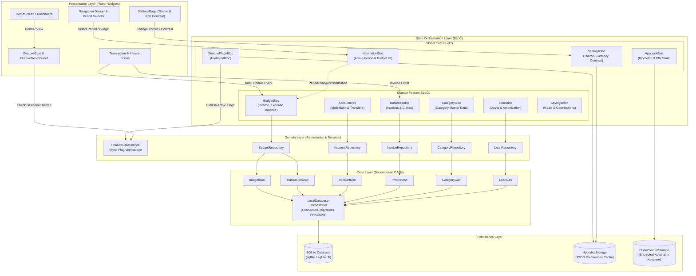

# BLoC State Orchestration & Data Flow Diagram

```mermaid
flowchart TD
    subgraph UI_Presentation_Layer ["Presentation Layer (Flutter Widgets)"]
        UI_Home["HomeScreen / Dashboard"]
        UI_Nav["Navigation Drawer & Period Selector"]
        UI_Gate["FeatureGate & FeatureRouteGuard"]
        UI_Settings["SettingsPage (Theme & High Contrast)"]
        UI_Forms["Transaction & Invoice Forms"]
    end

    subgraph State_Orchestration_Layer ["State Orchestration Layer (BLoC)"]
        direction TB
        subgraph Global_Blocs ["Global Core BLoCs"]
            FeatureFlagsBloc["FeatureFlagsBloc<br/>(HydratedBloc)"]
            SettingsBloc["SettingsBloc<br/>(Theme, Currency, Contrast)"]
            NavigationBloc["NavigationBloc<br/>(Active Period & Budget ID)"]
            AppLockBloc["AppLockBloc<br/>(Biometric & PIN State)"]
        end

        subgraph Feature_Blocs ["Domain Feature BLoCs"]
            BudgetBloc["BudgetBloc<br/>(Income, Expense, Balance)"]
            CategoryBloc["CategoryBloc<br/>(Category Master Data)"]
            AccountBloc["AccountBloc<br/>(Multi-Bank & Transfers)"]
            BusinessBloc["BusinessBloc<br/>(Invoices & Clients)"]
            LoanBloc["LoanBloc<br/>(Loans & Amortization)"]
            SavingsBloc["SavingsBloc<br/>(Goals & Contributions)"]
        end
    end

    subgraph Domain_Services ["Domain Layer (Repositories & Services)"]
        GateService["FeatureGateService<br/>(Sync Flag Verification)"]
        BudgetRepo["BudgetRepository"]
        AccountRepo["AccountRepository"]
        InvoiceRepo["InvoiceRepository"]
        CategoryRepo["CategoryRepository"]
        LoanRepo["LoanRepository"]
    end

    subgraph Data_Access_Layer ["Data Layer (Decomposed DAOs)"]
        LocalDB["LocalDatabase Orchestrator<br/>(Connection, Migrations, PRAGMAs)"]
        BudgetDao["BudgetDao"]
        TxDao["TransactionDao"]
        AccountDao["AccountDao"]
        InvoiceDao["InvoiceDao"]
        CategoryDao["CategoryDao"]
        LoanDao["LoanDao"]
    end

    subgraph Persistence_Engines ["Persistence Layer"]
        SQLite[("SQLite Database<br/>(sqflite / sqflite_ffi)")]
        HydratedStore[("HydratedStorage<br/>(JSON Preferences Cache)")]
        SecureStore[("FlutterSecureStorage<br/>(Encrypted Keychain / Keystore)")]
    end

    UI_Nav -->|Select Period / Budget| NavigationBloc
    UI_Settings -->|Change Theme / Contrast| SettingsBloc
    UI_Forms -->|Add / Update Event| BudgetBloc
    UI_Forms -->|Invoice Event| BusinessBloc
    UI_Home -->|Render View| UI_Gate

    NavigationBloc -.->|PeriodChanged Notification| BudgetBloc
    FeatureFlagsBloc -->|Publish Active Flags| GateService
    UI_Gate -->|Check isFeatureEnabled| GateService

    BudgetBloc --> BudgetRepo
    CategoryBloc --> CategoryRepo
    AccountBloc --> AccountRepo
    BusinessBloc --> InvoiceRepo
    LoanBloc --> LoanRepo

    BudgetRepo --> BudgetDao
    BudgetRepo --> TxDao
    CategoryRepo --> CategoryDao
    AccountRepo --> AccountDao
    InvoiceRepo --> InvoiceDao
    LoanRepo --> LoanDao

    BudgetDao --> LocalDB
    TxDao --> LocalDB
    AccountDao --> LocalDB
    InvoiceDao --> LocalDB
    CategoryDao --> LocalDB
    LoanDao --> LocalDB
    LocalDB --> SQLite

    FeatureFlagsBloc --> HydratedStore
    SettingsBloc --> HydratedStore
    AppLockBloc --> SecureStore
```
