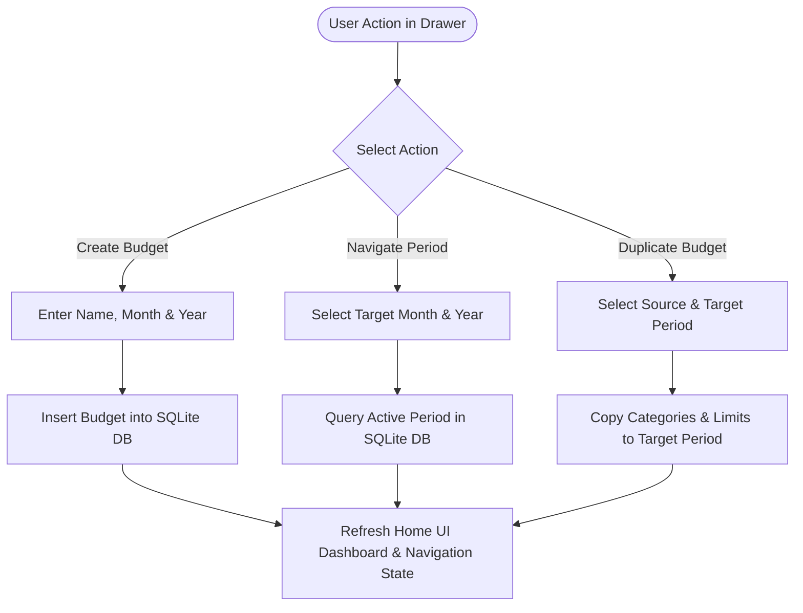

# Budget Management Use Case Flow Diagram

```mermaid
flowchart TD
    Start([User Action in Drawer]) --> Choice{Select Action}

    Choice -->|Create Budget| Create[Enter Name, Month & Year]
    Choice -->|Navigate Period| Nav[Select Target Month & Year]
    Choice -->|Duplicate Budget| Copy[Select Source & Target Period]

    Create --> SaveDB[Insert Budget into SQLite DB]
    Nav --> FetchDB[Query Active Period in SQLite DB]
    Copy --> CopyDB[Copy Categories & Limits to Target Period]

    SaveDB --> Refresh[Refresh Home UI Dashboard & Navigation State]
    FetchDB --> Refresh
    CopyDB --> Refresh
```
