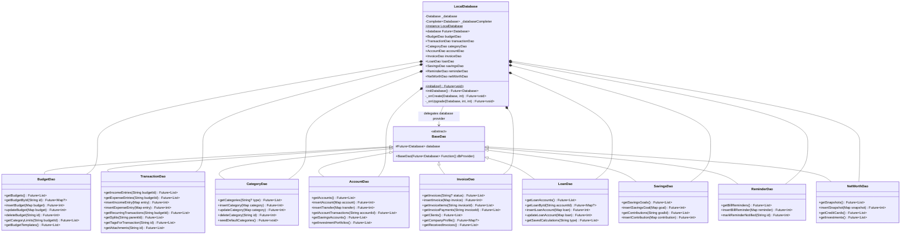

# Refactored DAO Database Architecture Diagram

```mermaid
classDiagram
    class LocalDatabase {
        -Database _database
        -Completer~Database~ _databaseCompleter
        +instance LocalDatabase$
        +initialize() Future~void~$
        +database Future~Database~
        +initDatabase() Future~Database~
        -_onCreate(Database, int) Future~void~
        -_onUpgrade(Database, int, int) Future~void~
        +BudgetDao budgetDao
        +TransactionDao transactionDao
        +CategoryDao categoryDao
        +AccountDao accountDao
        +InvoiceDao invoiceDao
        +LoanDao loanDao
        +SavingsDao savingsDao
        +ReminderDao reminderDao
        +NetWorthDao netWorthDao
    }

    class BaseDao {
        <<abstract>>
        #Future~Database~ database
        +BaseDao(Future~Database~ Function() dbProvider)
    }

    class BudgetDao {
        +getBudgets() Future~List~
        +getBudgetById(String id) Future~Map?~
        +insertBudget(Map budget) Future~int~
        +updateBudget(Map budget) Future~int~
        +deleteBudget(String id) Future~int~
        +getCategoryLimits(String budgetId) Future~List~
        +getBudgetTemplates() Future~List~
    }

    class TransactionDao {
        +getIncomeEntries(String budgetId) Future~List~
        +getExpenseEntries(String budgetId) Future~List~
        +insertIncomeEntry(Map entry) Future~int~
        +insertExpenseEntry(Map entry) Future~int~
        +getRecurringTransactions(String budgetId) Future~List~
        +getSplits(String parentId) Future~List~
        +getTagsForTransaction(String id) Future~List~
        +getAttachments(String id) Future~List~
    }

    class CategoryDao {
        +getCategories(String? type) Future~List~
        +insertCategory(Map category) Future~int~
        +updateCategory(Map category) Future~int~
        +deleteCategory(String id) Future~int~
        +seedDefaultCategories() Future~void~
    }

    class AccountDao {
        +getAccounts() Future~List~
        +insertAccount(Map account) Future~int~
        +insertTransfer(Map transfer) Future~int~
        +getAccountTransactions(String accountId) Future~List~
        +getSavingsAccounts() Future~List~
        +getInvestmentPortfolios() Future~List~
    }

    class InvoiceDao {
        +getInvoices(String? status) Future~List~
        +insertInvoice(Map invoice) Future~int~
        +getInvoiceItems(String invoiceId) Future~List~
        +getInvoicePayments(String invoiceId) Future~List~
        +getClients() Future~List~
        +getCompanyProfile() Future~Map?~
        +getReceivedInvoices() Future~List~
    }

    class LoanDao {
        +getLoanAccounts() Future~List~
        +getLoanById(String accountId) Future~Map?~
        +insertLoanAccount(Map loan) Future~int~
        +updateLoanAccount(Map loan) Future~int~
        +getSavedCalculations(String type) Future~List~
    }

    class SavingsDao {
        +getSavingsGoals() Future~List~
        +insertSavingsGoal(Map goal) Future~int~
        +getContributions(String goalId) Future~List~
        +insertContribution(Map contribution) Future~int~
    }

    class ReminderDao {
        +getBillReminders() Future~List~
        +insertBillReminder(Map reminder) Future~int~
        +markReminderNotified(String id) Future~int~
    }

    class NetWorthDao {
        +getSnapshots() Future~List~
        +insertSnapshot(Map snapshot) Future~int~
        +getCreditCards() Future~List~
        +getInvestments() Future~List~
    }

    LocalDatabase --> BaseDao : delegates database provider
    BaseDao <|-- BudgetDao
    BaseDao <|-- TransactionDao
    BaseDao <|-- CategoryDao
    BaseDao <|-- AccountDao
    BaseDao <|-- InvoiceDao
    BaseDao <|-- LoanDao
    BaseDao <|-- SavingsDao
    BaseDao <|-- ReminderDao
    BaseDao <|-- NetWorthDao

    LocalDatabase *-- BudgetDao
    LocalDatabase *-- TransactionDao
    LocalDatabase *-- CategoryDao
    LocalDatabase *-- AccountDao
    LocalDatabase *-- InvoiceDao
    LocalDatabase *-- LoanDao
    LocalDatabase *-- SavingsDao
    LocalDatabase *-- ReminderDao
    LocalDatabase *-- NetWorthDao
```
