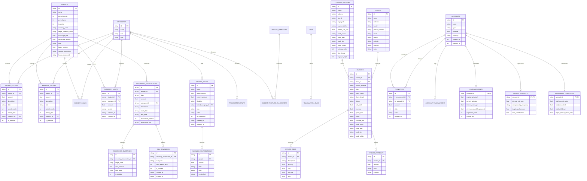

# Complete SQLite Schema v28 Entity Relationship Diagram

```mermaid
erDiagram
    BUDGETS ||--o{ INCOME_ENTRIES : "contains"
    BUDGETS ||--o{ EXPENSE_ENTRIES : "contains"
    BUDGETS ||--o{ BUDGET_GOALS : "defines"
    BUDGETS ||--o{ CATEGORY_LIMITS : "sets"
    BUDGETS ||--o{ RECURRING_TRANSACTIONS : "schedules"

    CATEGORIES ||--o{ INCOME_ENTRIES : "categorizes"
    CATEGORIES ||--o{ EXPENSE_ENTRIES : "categorizes"
    CATEGORIES ||--o{ BUDGET_GOALS : "targets"
    CATEGORIES ||--o{ CATEGORY_LIMITS : "restricts"
    CATEGORIES ||--o{ SAVINGS_GOALS : "links"
    CATEGORIES ||--o{ TRANSACTION_SPLITS : "allocates"
    CATEGORIES ||--o{ BUDGET_TEMPLATE_ALLOCATIONS : "allocates"

    RECURRING_TRANSACTIONS ||--o{ RECURRING_OVERRIDES : "overrides"
    RECURRING_TRANSACTIONS ||--o{ BILL_REMINDERS : "notifies"

    SAVINGS_GOALS ||--o{ SAVINGS_CONTRIBUTIONS : "receives"

    BUDGET_TEMPLATES ||--o{ BUDGET_TEMPLATE_ALLOCATIONS : "composes"

    TAGS ||--o{ TRANSACTION_TAGS : "labels"

    COMPANY_PROFILES ||--o{ INVOICES : "issues"
    CLIENTS ||--o{ INVOICES : "billed_to"
    INVOICES ||--o{ INVOICE_ITEMS : "contains"
    INVOICES ||--o{ INVOICE_PAYMENTS : "settles"

    ACCOUNTS ||--o{ TRANSFERS : "source_of"
    ACCOUNTS ||--o{ TRANSFERS : "dest_of"
    ACCOUNTS ||--o{ ACCOUNT_TRANSACTIONS : "logs"
    ACCOUNTS ||--o| LOAN_ACCOUNTS : "specializes"
    ACCOUNTS ||--o| SAVINGS_ACCOUNTS : "specializes"
    ACCOUNTS ||--o| INVESTMENT_PORTFOLIOS : "specializes"

    BUDGETS {
        string id PK
        string name
        int period_month
        int period_year
        int is_active
        string currency_code
        string target_currency_code
        float exchange_rate
        float converted_amount
        string type
        float target_income
        string source_description
        string linked_income_id
    }

    INCOME_ENTRIES {
        string id PK
        string budget_id FK
        float amount
        string description
        string date
        int period_month
        int period_year
        string category_id FK
        int is_potential
    }

    EXPENSE_ENTRIES {
        string id PK
        string budget_id FK
        float amount
        string description
        string date
        int period_month
        int period_year
        string category_id FK
        int is_potential
    }

    CATEGORIES {
        string id PK
        string name
        string icon
        string type
    }

    CATEGORY_LIMITS {
        string id PK
        string budget_id FK
        string category_id FK
        float amount
        string period
        string created_at
        string updated_at
    }

    SAVINGS_GOALS {
        string id PK
        string name
        float target_amount
        float current_amount
        string deadline
        string linked_category_id FK
        string icon
        string color
        int is_completed
        string created_at
        string updated_at
    }

    SAVINGS_CONTRIBUTIONS {
        string id PK
        string goal_id FK
        float amount
        string date
        string note
        string created_at
    }

    RECURRING_TRANSACTIONS {
        string id PK
        string budget_id FK
        string type
        float amount
        string category_id FK
        string description
        string start_date
        string end_date
        int recurrence_interval
        string recurrence_unit
    }

    RECURRING_OVERRIDES {
        string id PK
        string recurring_transaction_id FK
        string target_date
        float new_amount
        string new_date
        int is_deleted
    }

    BILL_REMINDERS {
        string id PK
        string recurring_transaction_id FK
        string due_date
        int days_before_due
        int is_notified
        string notified_at
        string created_at
    }

    INVOICES {
        string id PK
        string profile_id FK
        string client_id FK
        string invoice_number
        string date
        string client_name
        string client_details
        string status
        float sub_total
        float tax_total
        float grand_total
        string notes
        float balance_due
        string bank_name
        string bank_iban
        string bank_bic
        string bank_holder
    }

    INVOICE_ITEMS {
        string id PK
        string invoice_id FK
        string description
        float quantity
        float rate
        float tax_rate
        float total
    }

    INVOICE_PAYMENTS {
        string id PK
        string invoice_id FK
        float amount
        string date
        string method
    }

    CLIENTS {
        string id PK
        string name
        string address
        string tax_id
        string primary_contact
        string email
        string phone
        string website
        string industry
        string notes
    }

    COMPANY_PROFILES {
        string id PK
        string name
        string address
        string tax_id
        string logo_path
        string payment_info
        float default_vat_rate
        string bank_name
        string bank_iban
        string bank_bic
        string bank_holder
        int primary_color
        string font_family
        int logo_on_right
    }

    ACCOUNTS {
        string id PK
        string name
        string type
        float balance
        string currency
        int created_at
        int updated_at
    }

    TRANSFERS {
        string id PK
        string from_account_id FK
        string to_account_id FK
        float amount
        int date
        string note
        int created_at
    }

    LOAN_ACCOUNTS {
        string account_id PK,FK
        float original_principal
        float current_principal
        float interest_rate_apr
        float minimum_monthly_payment
        int origination_date
        int is_paid_off
    }

    SAVINGS_ACCOUNTS {
        string account_id PK,FK
        float interest_rate_apy
        string compounding_frequency
        float target_goal_amount
        float total_contributions
    }

    INVESTMENT_PORTFOLIOS {
        string account_id PK,FK
        float total_market_value
        float total_deposited
        float total_withdrawn
        float target_annual_return_rate
    }
```
