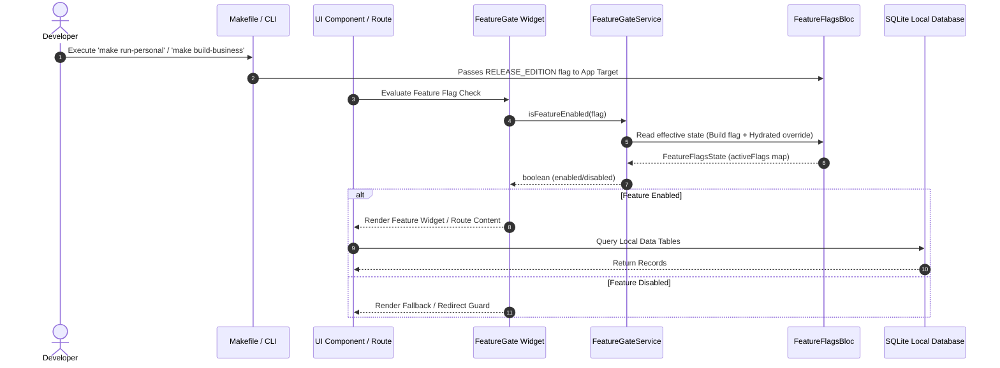

# Feature Gate Execution Sequence Diagram

```mermaid
sequenceDiagram
    autonumber
    actor Developer
    participant Make as Makefile / CLI
    participant View as UI Component / Route
    participant Gate as FeatureGate Widget
    participant Service as FeatureGateService
    participant Bloc as FeatureFlagsBloc
    participant DB as SQLite Local Database

    Developer->>Make: Execute 'make run-personal' / 'make build-business'
    Make->>Bloc: Passes RELEASE_EDITION flag to App Target
    View->>Gate: Evaluate Feature Flag Check
    Gate->>Service: isFeatureEnabled(flag)
    Service->>Bloc: Read effective state (Build flag + Hydrated override)
    Bloc-->>Service: FeatureFlagsState (activeFlags map)
    Service-->>Gate: boolean (enabled/disabled)

    alt Feature Enabled
        Gate-->>View: Render Feature Widget / Route Content
        View->>DB: Query Local Data Tables
        DB-->>View: Return Records
    else Feature Disabled
        Gate-->>View: Render Fallback / Redirect Guard
    end
```
