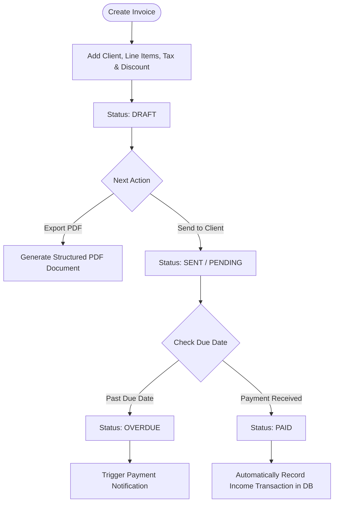

# Invoice Management Use Case Flow Diagram

```mermaid
flowchart TD
    Start([Create Invoice]) --> AddDetails[Add Client, Line Items, Tax & Discount]
    AddDetails --> Draft[Status: DRAFT]

    Draft --> Choice{Next Action}
    Choice -->|Export PDF| PDF[Generate Structured PDF Document]
    Choice -->|Send to Client| Sent[Status: SENT / PENDING]

    Sent --> CheckDue{Check Due Date}
    CheckDue -->|Past Due Date| Overdue[Status: OVERDUE]
    CheckDue -->|Payment Received| Paid[Status: PAID]

    Overdue --> Remind[Trigger Payment Notification]
    Paid --> RecordIncome[Automatically Record Income Transaction in DB]
```
