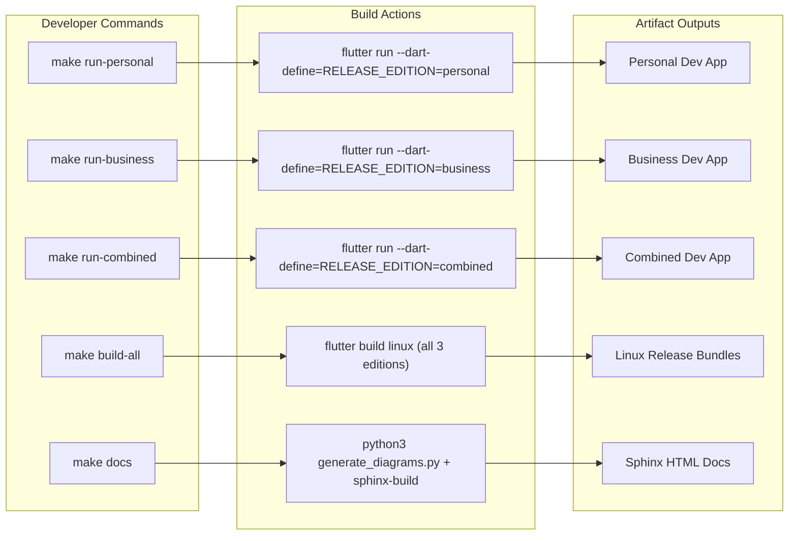

# Makefile Build & Execution Workflow Diagram

```mermaid
flowchart LR
    subgraph Developer Commands
        M1["make run-personal"]
        M2["make run-business"]
        M3["make run-combined"]
        M4["make build-all"]
        M5["make docs"]
    end

    subgraph Build Actions
        A1["flutter run --dart-define=RELEASE_EDITION=personal"]
        A2["flutter run --dart-define=RELEASE_EDITION=business"]
        A3["flutter run --dart-define=RELEASE_EDITION=combined"]
        A4["flutter build linux (all 3 editions)"]
        A5["python3 generate_diagrams.py + sphinx-build"]
    end

    subgraph Artifact Outputs
        O1["Personal Dev App"]
        O2["Business Dev App"]
        O3["Combined Dev App"]
        O4["Linux Release Bundles"]
        O5["Sphinx HTML Docs"]
    end

    M1 --> A1 --> O1
    M2 --> A2 --> O2
    M3 --> A3 --> O3
    M4 --> A4 --> O4
    M5 --> A5 --> O5
```
