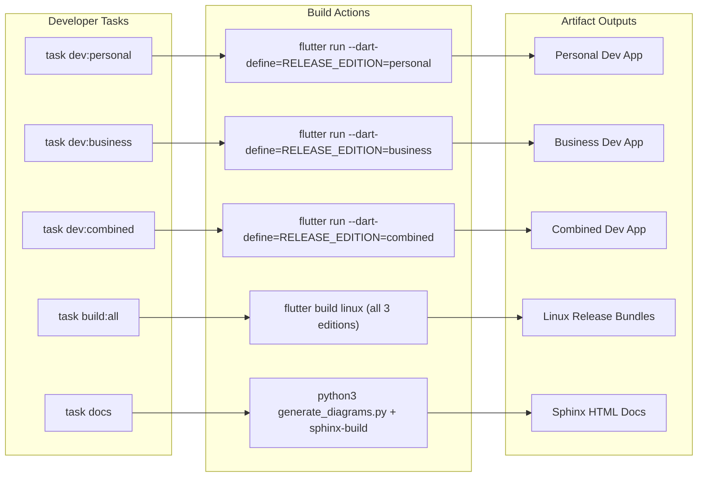

# Taskfile Build & Execution Workflow Diagram

```mermaid
flowchart LR
    subgraph Developer Tasks
        T1["task dev:personal"]
        T2["task dev:business"]
        T3["task dev:combined"]
        T4["task build:all"]
        T5["task docs"]
    end

    subgraph Build Actions
        A1["flutter run --dart-define=RELEASE_EDITION=personal"]
        A2["flutter run --dart-define=RELEASE_EDITION=business"]
        A3["flutter run --dart-define=RELEASE_EDITION=combined"]
        A4["flutter build linux (all 3 editions)"]
        A5["python3 generate_diagrams.py + sphinx-build"]
    end

    subgraph Artifact Outputs
        O1["Personal Dev App"]
        O2["Business Dev App"]
        O3["Combined Dev App"]
        O4["Linux Release Bundles"]
        O5["Sphinx HTML Docs"]
    end

    T1 --> A1 --> O1
    T2 --> A2 --> O2
    T3 --> A3 --> O3
    T4 --> A4 --> O4
    T5 --> A5 --> O5
```
