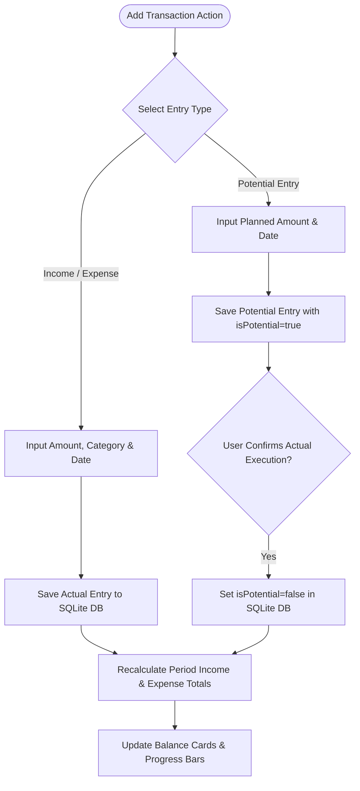

# Transaction Lifecycle Use Case Flow Diagram

```mermaid
flowchart TD
    Start([Add Transaction Action]) --> Type{Select Entry Type}

    Type -->|Income / Expense| Form[Input Amount, Category & Date]
    Type -->|Potential Entry| Planned[Input Planned Amount & Date]

    Form --> SaveActual[Save Actual Entry to SQLite DB]
    Planned --> SavePotential[Save Potential Entry with isPotential=true]

    SavePotential --> Confirm{User Confirms Actual Execution?}
    Confirm -->|Yes| UpdatePotential[Set isPotential=false in SQLite DB]

    SaveActual --> Recalc[Recalculate Period Income & Expense Totals]
    UpdatePotential --> Recalc
    Recalc --> UpdateUI[Update Balance Cards & Progress Bars]
```
